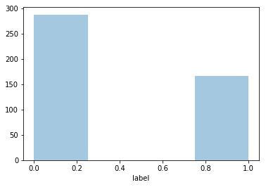
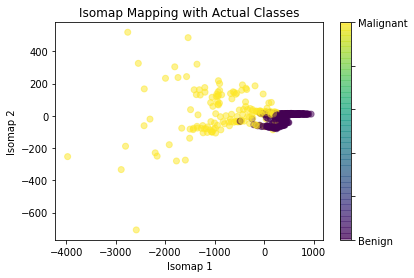
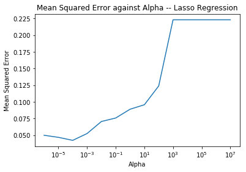
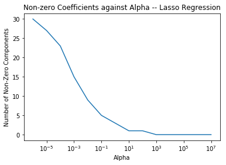
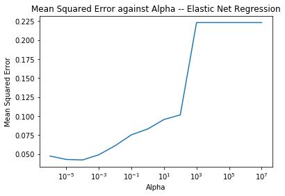
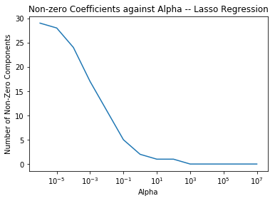
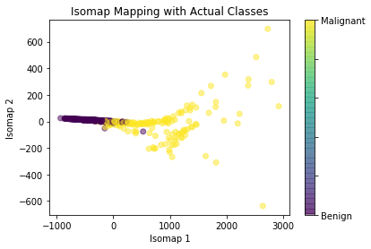

# Wisconson Breast Cancer Data Exploration and Analysis

### EDA and Initial Visualizations
The first thing I did upon importing my dataset into Python was to look at the distribution of all my features, as well as the labels.

We can see here that while there are slightly more benign tumors (coded as 0), the dataset is roughly split 60-40, which should not create too many issues that we would have if the data was more extremely unbalanced.

The next thing I did was try to reduce the dimensionality of the features matrix so that I could attempt to visualize it and see if there is a natural boundary between our classes that can be easily drawn in a lower dimensional space.

As we can see, there actually is quite a nice vertical boundary we could draw, telling us that the first Isomap coordinate contains a lot of information that helps us determine the class of each tumor. I also attempted to fit a Gaussian Mixture model to this data with 2 components, and got MSE of 0.06593 on the validation set; an exceptionally good score which tells us that there is enough infomration in all of these features to allow us to cluster the points extremely well, and the plot generated by these predictions looks almost identical to the ones above.

### Preliminary Feature Filtering

Next, I used Lasso regression as a filtering pass to eliminate a few of my 30 features, before attempting to fit a model for classification. The MSE for varying values of $\alpha$ is below.

As we can see, the optimal $\alpha$ appears to be $\alpha=0.0001$

The number of non-zero parameters at this alpha level varies if a random state is not set, but it is generally somewhere between 19 and 22 features.

I then also attempted to use Elastic Net regression as an alternative filter, to see if some of these removed features could be kept with low weights, rather than completely zeroed out. The plots of MSE and non-zero parameters are below

Again we see that the optimal level of $\alpha$ is around $\alpha=0.0001$, and the number of non-zero coefficeints at this point is slightly higher than that in Lasso; generally ranging fro0m 23-27 features selected. In general, the Elastic Net model included all of the features selected by the Lasso model, and so I believe it is likely that the Lasso model is preferable, due to it scoring nearly as well as the Elastic Net model with fewer features, which should help us reduce overfitting somewhat.

I then tried to fit two types of models using these sets of features: a $k$-NN classifier, and a Random Forest classifier. I made sure to scale the features before fitting the model, as $k$-NN is sensitive to this. Because random forests are scale invariant, this should not be an issue there.

### Model Selection
##### k-NN
Performing grid search cross validation for the optimal number of neighbours in $k$-NN with the features selected by Lasso regression results in accuracy of 93.8% on my test set. I chose accuracy in order to make interpretation of the results relatively easy, and becaue the classes were mostly balanced, I did not think it would be a huge issue to use this rather than MSE. The optimal number of neighbours chosen was 3.

Performing the same cross validation with the Elastic Net features also returns 3 as the optimal number of neighbours. The accuracy of this model on the test set is 94.7%, but given that we are using 5 more features than the Lasso model for a 1% gain in accuracy, I do not think the tradeoff was worth it, as we could be overfitting here.

##### Random forests

Using Random Forests instead of k-NN allowed us to increase accuracy even further. Now we are searching over max_depth as well as max_features for our hyperparameter optimization. For the features from Lasso, we get a max_depth of 9, with a maximum of 4 features used. Our accuracy on the test set with this specification is 95.6%, and MSE was 0.043859. An approximately 2% increase in accuracy over k-NN while using the same feature set.

With the features from Elastic Net, we get an optimal `max_depth` of 13, and `max_features` of 8. This increases our accuracy to 96.4%, or gives us an MSE of 0.0350877 but as with the $k$-NN model; I do not think a 1% gain in accuracy is sufficient to allow 5 additional features to be used in our model.

### Selecting the most important features.

Finally, I performed a final round of feature selection using RFE on the basic Random Forest Classifier in order to pick out the 5 most important features in our dataset for predicting whether a given tumor was malignant or benign.

Both filtered feature sets return nearly the same 5 most important features, with only a few differences. The feature set from Lasso generally only selects the average number of concave points, whereas the Elastic Net also selects the average concavity of the tumor in addition to this. As a result, the Lasso feature set chooses the worst radius whereas the feature set from Elastic Net does not.

Below is an example of what the 5 most important features look like from each of the two filtered sets.

##### 5 Features -- Filtered with Lasso
['avg_conc_p', 'wor_rad', 'wor_peri', 'wor_area', 'wor_conc_p']

##### 5 Features -- Filtered with Elastic Net
['avg_concav', 'avg_conc_p', 'wor_peri', 'wor_area', 'wor_conc_p']

Fitting a default Random Forest with the above featuers gives us MSE of 0.05263 with the features selected from the Lasso filtered set, and MSE of 0.0701754 with the Elastic Net filtered set.

These MSE values are comparable to the ones obtained above when using 20-25 features, and so I would argue that these 5 features are sufficient to capture nearly all the variation in our data that allows us to classify our observations into benign (0) or malignant (1). In fact, if we use these predicted values rather than the original labels, we would draw nearly the exact same boundary as we would have above.

